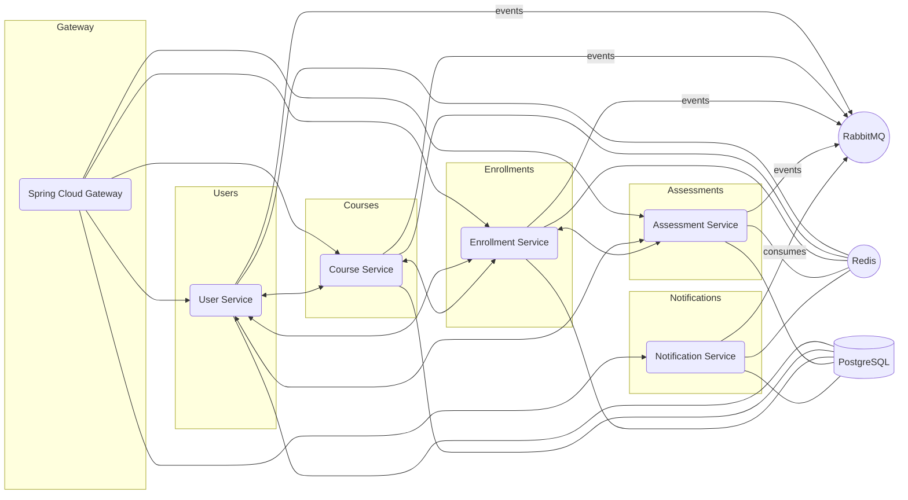

# Design microservices architecture for LMS
_Exported on 7/3/2025 at 13:04:44 GMT+5:30 from Cursor (1.1.7)_

---

**User**


Design a microservices architecture for a learning
management system:
Services:
- User Service (students, instructors, admins)
- Course Service (course content, modules, lessons)
- Enrollment Service (student enrollments, progress tracking)
- Assessment Service (quizzes, assignments, grading)
- Notification Service (emails, push notifications)
Technical Stack:
- Spring Boot 3 with Spring WebFlux
- PostgreSQL with Spring Data JPA
- Redis for caching and sessions
- RabbitMQ for async messaging
- Spring Cloud Gateway for API routing
- Docker and Kubernetes deployment
Generate:
1. Service decomposition strategy
User Service

Handles: Students, instructors, admins

Responsibilities: Registration, role management, authentication

Notes: Central identity source; integrate with Spring Authorization Server or Keycloak

Course Service

Handles: Courses, modules, lessons

Responsibilities: Manage course content, outline, authoring

Notes: Publishes course lifecycle events

Enrollment Service

Handles: Course enrollments and progress tracking

Responsibilities: Enroll users, track lesson completion, compute progress

Notes: Uses CourseService events to track course availability

Assessment Service

Handles: Quizzes, assignments, grading

Responsibilities: Manage question banks, accept submissions, auto/manual grading

Notes: Emits grade-related events to downstream consumers

Notification Service

Handles: Email, push notifications

Responsibilities: Fan-out events from other services, user-preference based comms

Notes: Highly asynchronous, uses deduplication via Redis

Spring Cloud Gateway

API gateway for routing, auth, rate-limiting

Validates JWTs and propagates identity headers

Central enforcement point for security and throttling


---

**Cursor**

Here’s a **service decomposition strategy** for your Learning Management System (LMS) microservices architecture, tailored to your technical stack and requirements:

---

## 1. Service Decomposition Strategy

### **A. User Service**
- **Domain:** Students, Instructors, Admins
- **Responsibilities:**
  - User registration and profile management
  - Role and permission management (student, instructor, admin)
  - Authentication (integrate with Spring Authorization Server or Keycloak)
  - Central identity provider for all services (issue/validate JWTs)
- **Data:** User profiles, roles, credentials (PostgreSQL)
- **Integration:**
  - Publishes user lifecycle events (e.g., registration, role change) via RabbitMQ
  - Exposes REST APIs (Spring WebFlux)
  - Caches sessions/tokens in Redis

---

### **B. Course Service**
- **Domain:** Courses, Modules, Lessons
- **Responsibilities:**
  - CRUD for courses, modules, lessons
  - Course content authoring and versioning
  - Publishes course lifecycle events (created, updated, deleted) via RabbitMQ
- **Data:** Course structure, content, metadata (PostgreSQL)
- **Integration:**
  - Consumes user events for author/instructor validation
  - Exposes REST APIs (Spring WebFlux)
  - Caches frequently accessed course data in Redis

---

### **C. Enrollment Service**
- **Domain:** Enrollments, Progress Tracking
- **Responsibilities:**
  - Enroll/unenroll users in courses
  - Track lesson/module completion and compute progress
  - Listen to course and user events for consistency
- **Data:** Enrollment records, progress logs (PostgreSQL)
- **Integration:**
  - Consumes course/user events from RabbitMQ
  - Publishes enrollment/progress events (e.g., completion) via RabbitMQ
  - Exposes REST APIs (Spring WebFlux)
  - Caches active enrollments/progress in Redis

---

### **D. Assessment Service**
- **Domain:** Quizzes, Assignments, Grading
- **Responsibilities:**
  - Manage question banks, quiz/assignment definitions
  - Accept and store submissions
  - Auto/manual grading workflows
  - Emit grade-related events (e.g., graded, feedback) via RabbitMQ
- **Data:** Assessments, submissions, grades (PostgreSQL)
- **Integration:**
  - Consumes enrollment/course/user events for validation
  - Publishes assessment/grade events
  - Exposes REST APIs (Spring WebFlux)
  - Caches frequently accessed assessments in Redis

---

### **E. Notification Service**
- **Domain:** Email, Push Notifications
- **Responsibilities:**
  - Subscribe to events from other services (user, course, enrollment, assessment)
  - Fan-out notifications based on user preferences
  - Deduplicate notifications using Redis
- **Data:** Notification templates, user preferences (PostgreSQL)
- **Integration:**
  - Consumes events from RabbitMQ
  - Sends emails/push notifications asynchronously
  - Exposes REST APIs for notification preferences (Spring WebFlux)

---

### **F. Spring Cloud Gateway**
- **Domain:** API Gateway
- **Responsibilities:**
  - Central entry point for all client/API traffic
  - Route requests to appropriate services
  - Validate JWTs, propagate identity headers
  - Enforce security, rate-limiting, and throttling
- **Integration:**
  - Integrates with User Service/Authorization Server for authentication
  - Forwards requests to backend services
  - Centralized logging and monitoring

---

## **Cross-Cutting Concerns**
- **Service Discovery:** Use Kubernetes service discovery or Spring Cloud Discovery
- **Configuration Management:** Centralized config via Spring Cloud Config or Kubernetes ConfigMaps/Secrets
- **Observability:** Distributed tracing, logging, and metrics (e.g., ELK, Prometheus, Grafana)
- **Deployment:** Each service is containerized (Docker), orchestrated via Kubernetes

---

## **Event-Driven Interactions**
- **RabbitMQ** is used for:
  - Publishing and consuming domain events (user, course, enrollment, assessment, notification)
  - Decoupling services and enabling asynchronous workflows

---

## **Caching & Sessions**
- **Redis** is used for:
  - Caching frequently accessed data (courses, enrollments, assessments)
  - Session/token storage for stateless authentication
  - Notification deduplication

---

## **Diagram (Textual)**


---

Let me know if you want a **detailed breakdown** for any specific service, or a **sample folder structure** for one of the microservices!

```plaintext
flowchart LR
    subgraph Gateway
        GW(Spring Cloud Gateway)
    end
    subgraph Users
        US(User Service)
    end
    subgraph Courses
        CS(Course Service)
    end
    subgraph Enrollments
        ES(Enrollment Service)
    end
    subgraph Assessments
        AS(Assessment Service)
    end
    subgraph Notifications
        NS(Notification Service)
    end
    GW --> US
    GW --> CS
    GW --> ES
    GW --> AS
    GW --> NS
    US <--> CS
    US <--> ES
    US <--> AS
    CS <--> ES
    ES <--> AS
    US -- events --> RMQ((RabbitMQ))
    CS -- events --> RMQ
    ES -- events --> RMQ
    AS -- events --> RMQ
    NS -- consumes --> RMQ
    US --- REDIS((Redis))
    CS --- REDIS
    ES --- REDIS
    AS --- REDIS
    NS --- REDIS
    US --- PG[(PostgreSQL)]
    CS --- PG
    ES --- PG
    AS --- PG
    NS --- PG
```

